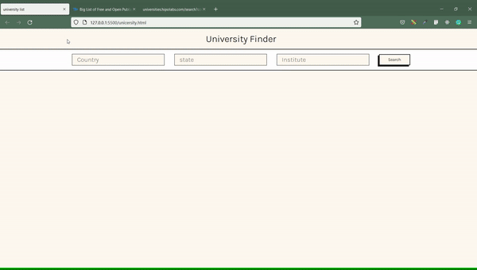

# University Finder
users can search universities all around the world 

## Demo

## Features 
- search by country, state or province, or institute name
- can visit the website 
- details of the university such as country and name are given in the ui

## Api used
https://github.com/Hipo/university-domains-list OR 
<a href="http://universities.hipolabs.com/search?country" target="_blank" >See the api data</a>

## Languages and tools used

- HTML/ CSS/ Javascript
- VSCode
